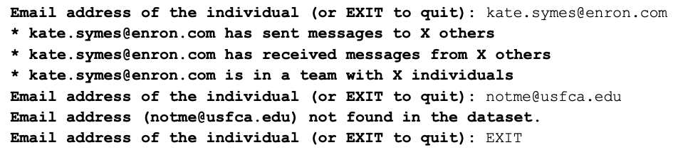

# Enron-Email-Graph-System

## Overview
This Java application parses and analyzes the Enron email dataset to reveal patterns in the email communication. 
The EnronEmailParser class contains methods for traversing the Enron email dataset, checking the validity of email files, parsing email addresses, and constructing a graph representation of the email communication. It also includes methods for identifying "connectors" (individuals who connect different parts of the network) and teams (groups of individuals who communicate frequently with each other).

The program employs techniques like Depth-First Search (DFS) to traverse the graph. The program also allows users to enter an email address and see how many messages the individual has sent and received, as well as the number of individuals in the same team.

<p align="center">
  
</p>

You can get a copy of the Enron dataset via https://www.cs.cmu.edu/~./enron/enron_mail_20150507.tar.gz. This dataset is large (1.7GB), and is provided as a compressed tar.gz file. On a Unix or MacOS system, you can uncompress it using the following command from a Unix shell or MacOS Terminal: <br>
```tar -xvzf enron_mail_20150507.tar.gz```


## Main idea of the graph
To represent the graph, an adjacency matrix has been utilized. This matrix provides a compact representation of the relationships between vertices. 
Edges in the graph are created whenever there is an exchange of messages between two vertices. Each edge represents a communication link between the corresponding vertices. 
The graph is undirected, which means the edges do not have a specific direction. 
Additionally, the graph is unweighted, implying that there is no additional information associated with the edges such as message frequency or intensity. 

## Data cleaning to check validity of email addresses
1. We have implemented a regular expression in the code to ensure that only unique email addresses are considered. 
2. Single quotes have been replaced with null in the code to handle cases where they may cause issues or conflicts. 
3. We have removed the dot at the beginning of instances where the text starts with "." in the code. 
4. We have filtered and considered only those email addresses that end with "Enron.com" in the code. 
5. We have excluded email addresses containing characters such as "#", "<", "_", "..", and "/o" in the code.  
 
 
## Data cleaning to check validity of mail files
1. Checked if the file is not empty.
2. Checked the file has the two main attributes in the header which are "To:" and "From:"
 
 
## Finding unique email addresses
1. Used the regex to some cleaning up and searched for valid email addresses first.
2. Then used Set to find unique email addresses from the attributes 'to', 'from', 'cc' and 'bcc'.
3. There are some email files with special case where there are multiple lines of 'to' address so my Connectors count is higher. 

## Finding connectors
1. Main calculations are in the methods getConnectors() and dfs().
2. Depth first search algorithm is implemented to find out the connectors between various senders and receivers. 
3. The dfs() method performs a DFS traversal on a graph and identifies the nodes that are connectors, i.e., nodes whose removal would increase the number of connected components in the graph.

## Finding teams
1. Main calculations are in the methods getTeams() and island_dfs().
2. Depth first search is implemented to find teams of individuals.


